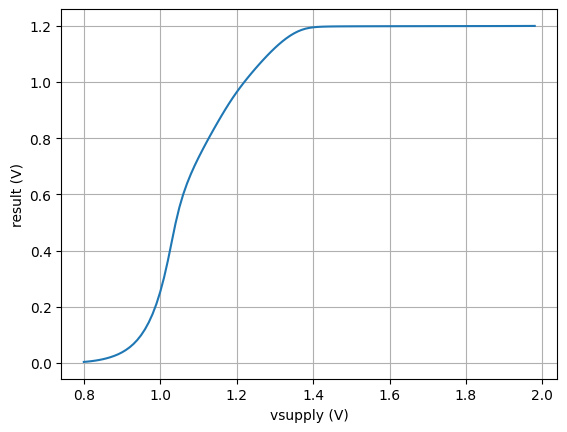
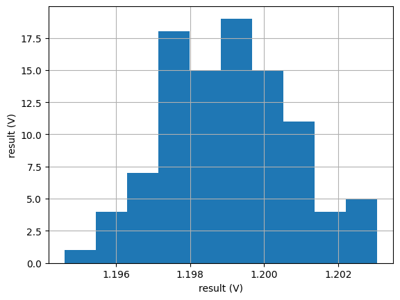

# sky130_ak_ip__cmos_vref
All-CMOS voltage reference based on NMOS threshold voltage temperature compensation.

This project is part of the chipalooza contest, submited for the "1.8V Precision Bandgap" slot, its development started just after my proposal was accepted, around 07/03/2024. Although the circuit is not really a bandgap voltage generator, it might be used as a precision voltage reference for the same purposes.

# Simulation Results

The circuit specifications are listed below, but they are getting better day by day, until the chipalooza schematic deadline!

| Measure                | Value   | Unit   |
| ---------------------- | ------- | ------ |
| Reference Voltage      | 1202    | mV     |
| Initial Accuracy (3s)  | .4012   | %      |
| Current Consumption    | ~2,2    | uA     |
| PSRR                   | 73,5    | dB     |
| Temperature Coeff.     | 35,5    | ppm/°C |
| Line Regulation        | 0.1519  | %      |
| Load Regulation        | 0.0345  | %      |

The temperature behavior is already adjusted, but using NFET1.8 transistors, the temperature coefficient specification of 30 ppm/°C will probably not be reached.

The image belows that the minimum voltage for the circuit to start operating as a voltage reference is around 1.4V.

Finally, process variation seem to be under control, the histogram below shows the variation range after
100 iterations of a monte carlo simulation.

